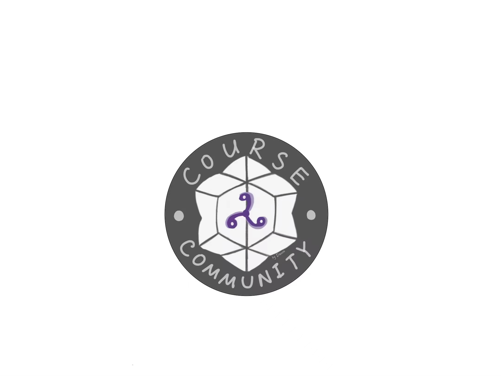

# 
 

## 
📚 CourseCommunity: Undergraduate Courses Notes Platform

- 这是一个主要面向北大同学的课程笔记互助分享平台，目前笔记包括但不仅限于物理、中文、哲学、医学专业课，以及通选课等约30门课程的笔记
- 这个文件夹最终将包含各个课程的各类笔记，包含但不仅限于电子版课程笔记、自己做的答疑视频或者帖子链接等。
- **项目网站：[Website](https://www.coursecommunity.com.cn)**
- **项目导览及目录请参考：[Contents](toc.md)**
- **社区公约请参考：[Guidelines](.assets/guidelines.md)**
### Repo creator: 仇是(StephenQS)
### 一代目：赵思淇，钟芳雄，许陌涵，卫家燊，施梓瀚，仇是，江玮陶，孙一杨，黄祉宾，申应君，叶桓岩
#### Logo created by qFF's()
## 🌟 Acknowledgements

感谢每一位贡献者的辛勤付出！所有的贡献者都会在首页被特别提及和感谢。

- **高驰肖** contributed to mathematics,  **所有**课程资料自取——个人主页**https://wqgcx.github.io/**
- **马艺铭** contributed to 线性代数（B），欢迎查看线代学习指南笔记！课程笔记原文件在北大树洞中~
- **谢佳芯** contributed to 地概整合版笔记
- **牟玉书** contributed to 理力录制课程（B站合集）个人留言：欢迎关注关注尾箕制氘匠（B站），后续会发布更多精彩内容~
- **ThomasYang** contributed to 量子力学、量子力学专题、群论II、数理方法、电动力学、理论力学
- **Perry** contributed to 非线性物理专题
- **曾偲** contributed to 高等数学（A）
- **StephenQS** contributed to 理论力学、普物实验、高等数学（A）、数理方法、地震概论、《庄子》精读、四书精读、光学
- **qFF's()** contributed to 医学史、马克思主义原理（医学部）
- **FurinaWai77** contributed to 可视化点群、量子场论、高等量子力学等，个人主页 **https://github.com/FurinaWai77** 欢迎大家关注~
- **Anonymous User_01** contributed to 中国古代文学史（三）、方言学、中国考古学（一）、社会人类学
- **St. Psalm** contributed to 平衡态统计物理、理论力学、电动力学
- **Raymond Wu** contrubuted to 政治经济学原理（对外经济贸易大学开设）
- **Louis ⅩⅥ** contributed to 死亡的社会学思考、基础医学导论
- **ጿ ኈ ቼ  ዽ ጿ ኈ ቼ  ዽ ጿ ኈ** contributed to 数学物理方法、理论力学
- **CarlosYang** contributed to 普物实验，高数
- **小迷糊** contributed to 平统、医学物理导论
- **林芊妤** contributed to 平统
- **罗西** contributed to 平统
- **陈风凌** contributed to 数学分析、高等代数、几何学等数院专业课，详见个人主页**https://github.com/mitdemwind/semester2-lecture-notes**
- **龙思成** contributed to 中级微观经济学
- **王楷越** contributed to 清华数学物理系列课程——基础物理学、高等微积分、电动力学、量子力学、数理方程、复变函数、分析力学，详见项目友链**https://github.com/Morris-w22/Mathematical_physics_curricula-note**
- **Jenny** contributed to 热学
---

## 📢 What's New

- **我们联系到了多位数院的优秀助教，获得了众多优秀笔记的授权，详情请密切跟进我们的公众号动态~**
- **9.4** 线性代数（B）发布，我们很荣幸得到了马艺铭学长的支持！作为北京大学最为欢迎的线性代数笔记，我们很高兴能得到学长官方的首肯~
- **8.3** 量子力学II、数理专题、高等量子力学、量子场论、高等原子分子物理笔记更新
- **8.2** 我们正式发布我们的CourseCommunity网站，在科学上网访问以及笔记下载问题上得到了完美解决!
- **7.4** 清华数学物理系列课程笔记发布！欢迎大家持续关注**https://github.com/Morris-w22/Mathematical_physics_curricula-note**
- **7.3** **笔记招募发布！** 欢迎大家关注 [https://mp.weixin.qq.com/s/-OdMJBZnbzrou8VjL4uCzg](https://mp.weixin.qq.com/s/-OdMJBZnbzrou8VjL4uCzg) ； 中级微观经济学、热学、光学笔记上传
- **6.26** **新增总览目录 [Contents](toc.md)**，方便大家查询
- **6.24** 数学分析、高等代数、几何学等数院专业课笔记发布
- **6.23** 项目公众号建立并发送第一篇推送！
- **6.18** 项目正式突破 100 Stars；平统笔记更新（两份 23 秋 yzc）
- **6.13** 项目得到了友校清华大学、对外经济贸易大学的同学支持，笔记课程及科目将适当拓展；高数笔记更新
- **6.12** 项目正式宣传公开，普物实验、数理方法、死亡的社会学思考、基础医学导论、医学物理导论、平统、理力、政治经济学原理（对外经济贸易大学开设）笔记更新
- **6.10** 项目运营 doc 发布（在 assets 中）
- **6.9** dwz 数理方法作业及难题交流答案发布
- **6.8** 中国古代文学史（三）、方言学、中国考古学（一）、社会人类学笔记发布；平统、电动、理力笔记更新；

---

## 📘 Courses and Notes

### 📐 Mathematics

- **assembly of numerous classes**
   - 个人主页：**https://github.com/mitdemwind/semester2-lecture-note**
   - 个人主页：**https://wqgcx.github.io/**
    
- **Advanced Mathematics**
  - 电子版课程笔记 √ 
  - 答疑视频 https://wqgcx.github.io/
  - 帖子链接

- **Linear Algebra**
  - 电子版课程笔记
  - 答疑视频 https://wqgcx.github.io/
  - 帖子链接

### 🔬 Physics
- **Assembly of Tsinghua University Physics Courses**
   - 个人项目主页：https://github.com/Morris-w22/Mathematical_physics_curricula-note
- **Theoretical Mechanics**
  - 电子版课程笔记 √
  - 答疑视频 https://space.bilibili.com/1036852626/channel/collectiondetail?sid=2017309
  - 帖子链接

- **Classical Electrodynamics**
  - 电子版课程笔记 √
  - 答疑视频
  - 帖子链接
 
- **Quantum Mechanics**
  - 电子版课程笔记 √
  - 答疑视频
  - 帖子链接

- **Group Theory**
  - 电子版课程笔记 √
  - 答疑视频
  - 帖子链接

- **Methematical Methods in Physics**
  - 电子版课程笔记 √
  - 答疑视频
  - 帖子链接

- **Special Topics in Quantum Phisics**
  - 电子版课程笔记 √
  - 答疑视频
  - 帖子链接

- **Special Topics in Non-Linear Physics**
  - 电子版课程笔记 √
  - 答疑视频
  - 帖子链接

- **Experiments**
  - 电子版课程笔记 √
  - 答疑视频
  - 帖子链接

- **Optics**
  - 电子版课程笔记 √
  - 答疑视频
  - 帖子链接

### 💻 Computer Science
- **Programming Fundamentals**
  - 电子版课程笔记
  - 答疑视频
  - 帖子链接

- **Data Structures**
  - 电子版课程笔记
  - 答疑视频
  - 帖子链接

### 🏥 Medicine
- **History of Medicine**
  - 电子版课程笔记 √
  - 答疑视频
  - 帖子链接

### 📚 General Education Courses
- **Introduction to Earthquakes**
  - 电子版课程笔记 √
  - 答疑视频
  - 帖子链接

---

## 📤 Contribution Guidelines

欢迎所有同学贡献他们的笔记和资源！请将你的笔记按以下格式提交：
1. 课程名称（包含授课教师、选课时间）
2. 资源类型（电子版课程笔记、答疑视频、帖子链接等）
3. 你的姓名（将会被在首页致谢）
#### Attention：单份笔记不超过25M，方便上传；若笔记过大请拆分处理
##### 如有上传笔记需求请发送笔记至coursecommunity@163.com
##### 网站仍在初步建设，欢迎一起加入！
---

## 📝 To-Do List

- [ ] 收集所有课程的电子版笔记，预计暑假初步收集完大一课程笔记，供下一届新生参考
- [ ] 收集相关答疑视频、答疑帖子等
- [ ] 整理并分类所有笔记和资源，建立用户反馈群，收集大家的建议

## 🌟Chat Group
### 由于群人数达到200，需要邀请进群，请添加以下管理员的微信申请进群：
# 
 

# 
 

